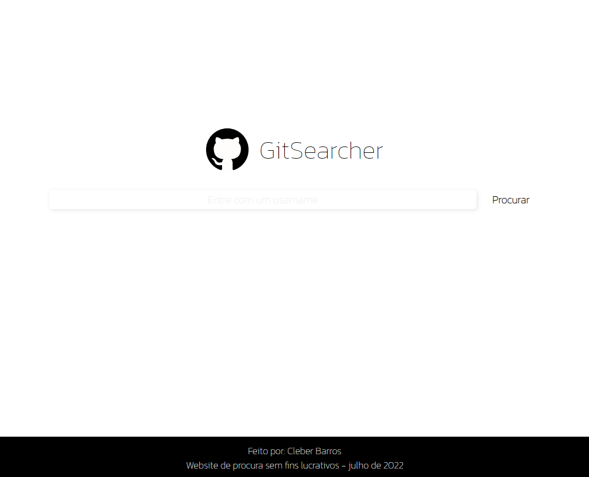

# GitSearcher - versão JS :heavy_check_mark:

Versão do projeto GitSearcher em JavaScript Vanila.
O projeto havia sido feito totalmente divido em componentes para atender ao desafio de ReactJS.

Dessa vez trago a versão em JS, sendo possível nesse caso ser acessado via GitHub pages.

Link para teste:
https://cleberbarros1.github.io/git-searcher-em-JavaScript-Vanila/

